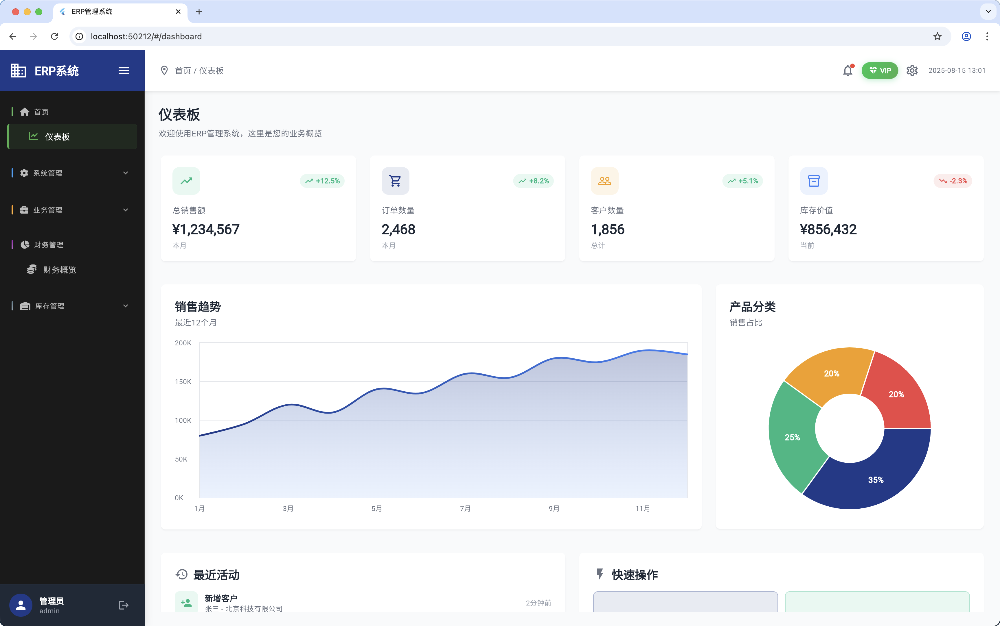
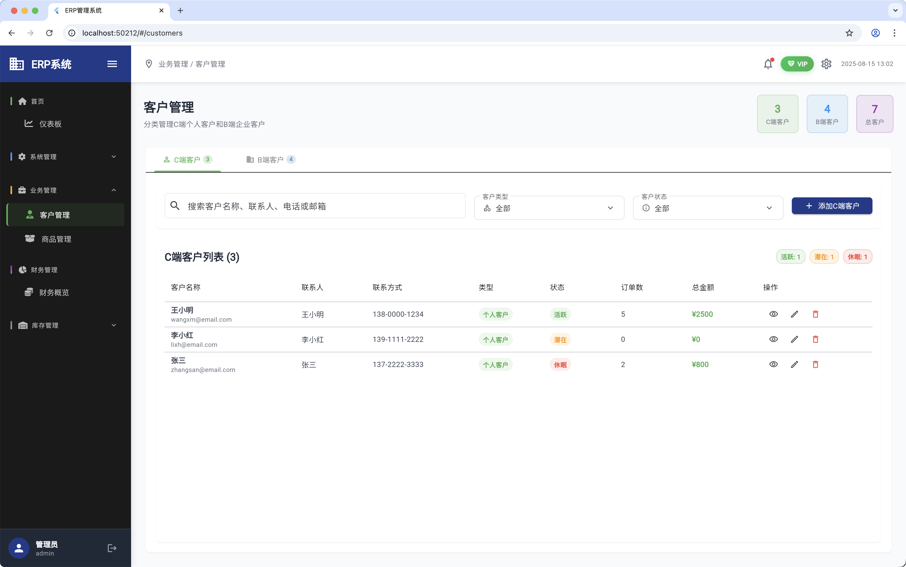

# Flutter Admin Web Template

[中文版本 / Chinese Version](README_zh.md)

A Flutter web project with admin dashboard functionality and custom UI components.

## 🌐 Live Demo

**[View Live Demo](https://flutter-admin-phi.vercel.app/)**

## Preview Screenshots

### Login Page

### Dashboard

### Management Pages

## Features

- Modern web-based admin interface
- Custom dropdown components with floating labels
- Responsive design with dark theme (black + green)
- Dashboard with various management modules
- User, customer, product, and inventory management
- Financial management and VIP system

## Getting Started

This project is a starting point for a Flutter web application with admin capabilities.

### Prerequisites

- Flutter SDK (latest stable version)
- Web browser for testing

### Installation

1. Clone the repository
2. Run `flutter pub get` to install dependencies
3. Run `flutter run -d chrome` to start the web application

## Project Structure

- `lib/pages/` - Main application pages
- `lib/widgets/` - Custom UI components
- `lib/models/` - Data models
- `lib/theme/` - Application theming
- `lib/routes/` - Navigation routing

## Custom Components

- **CustomDropdown**: Advanced dropdown with floating labels, animations, and modern styling
- **DashboardCard**: Reusable dashboard widgets
- **ChartCard**: Data visualization components

For help getting started with Flutter development, view the
[online documentation](https://docs.flutter.dev/), which offers tutorials,
samples, guidance on mobile development, and a full API reference.
