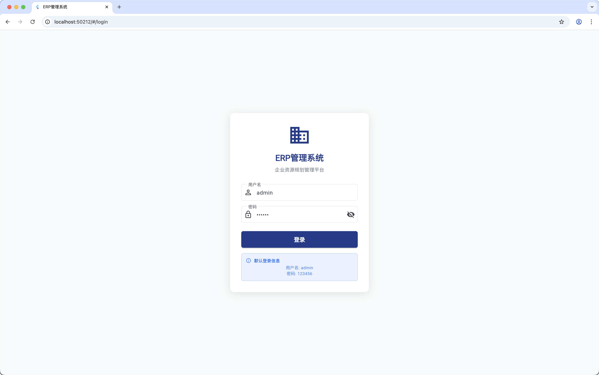
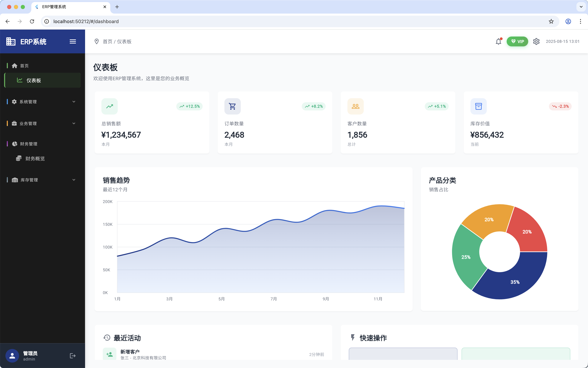
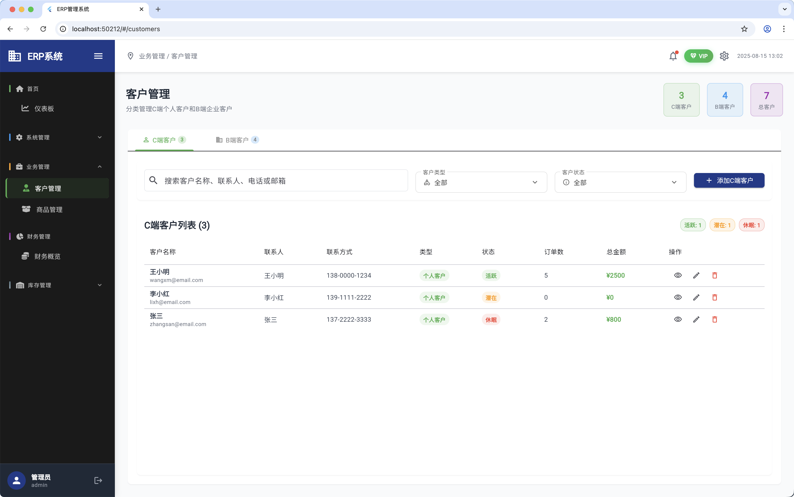

# Flutter 管理后台 Web 模板

[English Version / 英文版本](README.md)

一个具有管理仪表板功能和自定义UI组件的Flutter Web项目。

## 预览截图

### 登录页面

### 仪表板

### 管理页面

## 功能特性

- 现代化的Web管理界面
- 带浮动标签的自定义下拉组件
- 响应式设计，采用深色主题（黑色+绿色）
- 包含各种管理模块的仪表板
- 用户、客户、产品和库存管理
- 财务管理和VIP系统

## 快速开始

这个项目是一个具有管理功能的Flutter Web应用程序的起始模板。

### 前置要求

- Flutter SDK（最新稳定版本）
- 用于测试的Web浏览器

### 安装步骤

1. 克隆仓库
2. 运行 `flutter pub get` 安装依赖
3. 运行 `flutter run -d chrome` 启动Web应用程序

## 项目结构

- `lib/pages/` - 主要应用页面
- `lib/widgets/` - 自定义UI组件
- `lib/models/` - 数据模型
- `lib/theme/` - 应用主题
- `lib/routes/` - 导航路由

## 自定义组件

- **CustomDropdown**: 高级下拉框，具有浮动标签、动画和现代样式
- **DashboardCard**: 可重用的仪表板小部件
- **ChartCard**: 数据可视化组件

如需Flutter开发帮助，请查看
[在线文档](https://docs.flutter.dev/)，其中提供了教程、
示例、移动开发指导和完整的API参考。